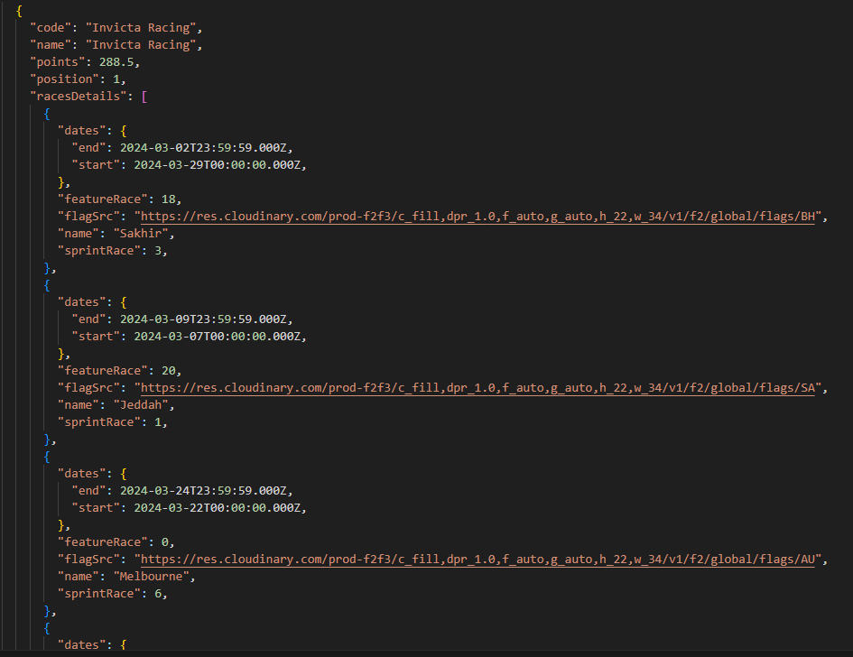
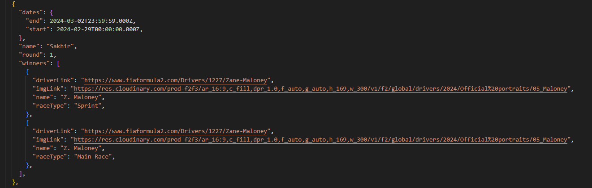

# F2-Scrapper

A Node.js web scraping tool for extracting data from F2 Website.

## Installation

```bash
git clone https://github.com/Matt443/F2-Scrapper.git
cd F2-Scrapper
npm install
```

## Usage

**For development:**

```bash
npm run dev
```

## Functions

### **1. getConstructorStandings**

| Needed Paramter | Paramter Description                                                      | Default Argument |
| --------------- | ------------------------------------------------------------------------- | ---------------- |
| No              | The year from which you want to extract points table for (2017 - current) | current year     |
| No              | if `racesDetails` property should be attached                             | `False`          |


### **2. getTeamStandings**

| Needed Paramter | Paramter Description                                                      | Default Argument |
| --------------- | ------------------------------------------------------------------------- | ---------------- |
| No              | The year from which you want to extract points table for (2017 - current) | current year     |
| No              | if `racesDetails` property should be attached                             | `False`          |



### **3. getCalendar**

| Needed Paramter | Paramter Description                                                      | Default Argument |
| --------------- | ------------------------------------------------------------------------- | ---------------- |
| No              | The year from which you want to extract points table for (2017 - current) | current year     |
| No              | if `winners` property should be attached                                  | `False`          |



### **4. getRaceResults**

| Needed Paramter | Paramter Description                                                      | Default Argument |
| --------------- | ------------------------------------------------------------------------- | ---------------- |
| No              | The year from which you want to extract points table for (2017 - current) | current year     |
| No              | Number id of Race Event or event name for example `Sakhir`                | `Sakhir`         |

```js
[
  {
    position: '1',
    number: 5,
    name: 'Z. Maloney',
    code: 'MAL',
    team: 'Rodin Motorsport',
    laps: 32,
    time: '1:02:46.435',
    gap: '-',
    int: '-',
    kph: '165.296',
    best: '1:46.813',
    lap: 23
  },
...
```

## Usage

WARNING: Abusing this library may result in an IP ban from the host website.  
Please use with caution and try to limit the rate and amount of your requests if you value your access to fiaformula2.com

## License

MIT License
